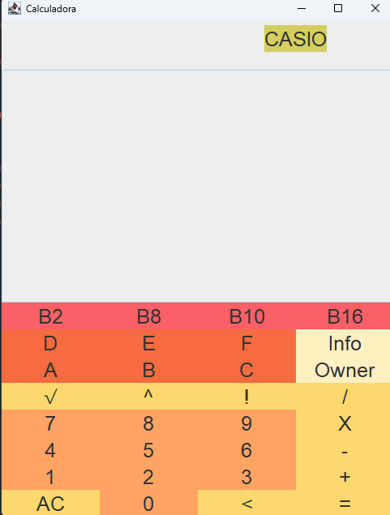
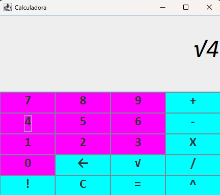
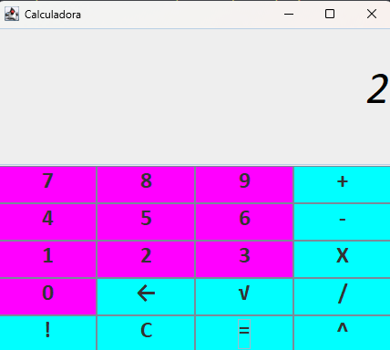
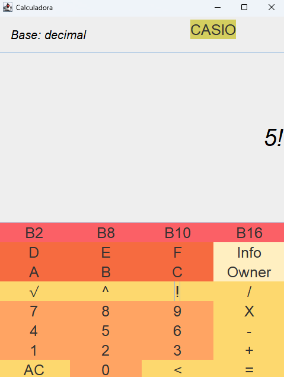
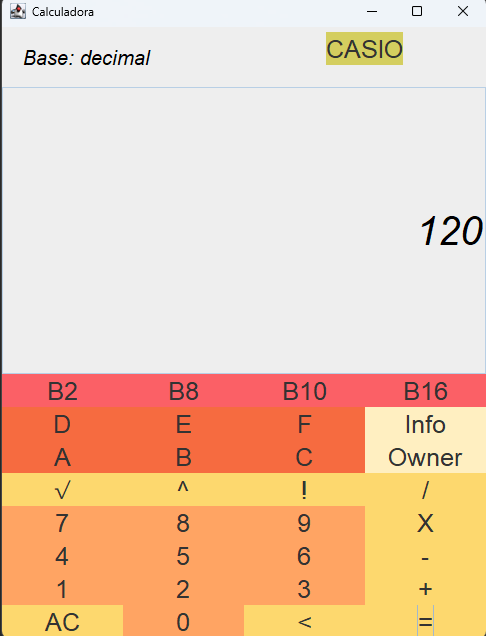
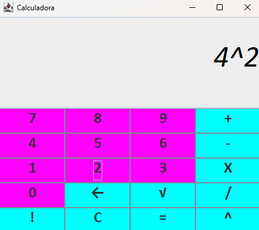

# Calculadora
Este proyecto es una calculadora gráfica desarrollada en **Java** utilizando la biblioteca *Swing*. La calculadora permite realizar operaciones básicas como suma, resta, multiplicación y división, proporcionando una interfaz amigable e interactiva.



# Características ✨
Interfaz gráfica creada con Swing.

- Operaciones soportadas:

    - Suma (+)

    - Resta (-)

    - Multiplicación (X)

    - División (/)

    - Potencia (^)

    - Raiz Cuadrada (√)

    - Factorial (!)

- Campo de texto para ingresar los números y el resultado.

- Botones para cada operación y para borrar los valores ingresados.

# Requisitos 🛠️
- Java Development Kit (JDK) 17 o superior.
- Un IDE como **IntelliJ IDEA**, **Eclipse**, o simplemente la consola para compilar y ejecutar.

# Instalación 📥
1. Clona este repositorio o descarga los archivos fuente.
```plaintext
git clone https://github.com/elenalf/Calculadora.git
```
2. Abre el proyecto en tu IDE favorito.

3. Asegúrate de tener configurado el entorno de Java correctamente.

4. Compila y ejecuta el archivo principal (Main.java).

# Uso 🚀
1. Haz clic en los numeros que deseas calcular

2. Selecciona la operación que deseas realizar presionando el botón correspondiente.

3. El resultado aparecerá en el campo de texto de salida.

4. Si deseas reiniciar, presiona el botón "C" (borrar).

# Estructura del Código 📂
Este proyecto tiene una estructura bastante sencilla.
- Main.java: Es la clase donde se inicializa el proyecto
- Engine.java: Es la clase donde se almacena toda la lógica de la calculadora

# Ejemplo de Operaciones
- Primera operación: 





- Segunda operación:





- Tercera operación:




- Cuarta operación:


# Autora 👤
Creado por *Elena López Félix*

